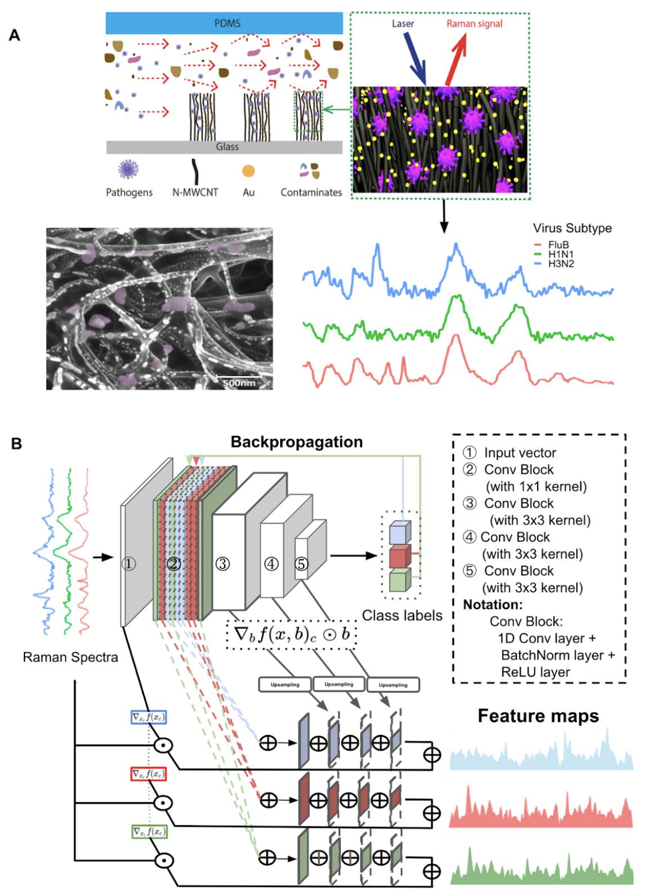

# Accurate Virus Identification with Interpretable Raman Signatures by Machine Learning

This is the pytorch implementation for our PNAS article.

> **Accurate Virus Identification with Interpretable Raman Signatures by Machine Learning'**<br>
Jiarong Ye, Yin-Ting Yeh, Yuan Xue, Ziyang Wang, Na Zhang, He Liu, Kunyan Zhang, RyeAnne Ricker, Zhuohang Yu, Allison Roder, Nestor Perea Lopez, Lindsey Organtini, Wallace Greene, Susan Hafenstein, Huaguang Lu, Elodie Ghedin, Mauricio Terrones, Shengxi Huang, Sharon Xiaolei Huang  <br>
> [paper]() (TBD upon publication) 
>
>**Abstract:** 
> Rapid identification of newly emerging or circulating viruses is an important first step toward managing the public health response to potential outbreaks. A portable virus capture device coupled with label-free Raman Spectroscopy holds the promise of fast detection by rapidly obtaining the Raman signature of a virus followed by a machine learning approach applied to recognize the virus based on its Raman spectrum, which is used as a fingerprint. We present such a machine learning approach for analyzing Raman spectra of human and avian viruses. A Convolutional Neural Network (CNN) classifier specifically designed for spectral data achieves very high accuracy for a variety of virus type or subtype identification tasks. In particular, it achieves 99% accuracy for classifying influenza virus type A vs. type B, 96% accuracy for classifying four subtypes of influenza A, 95% accuracy for differentiating enveloped and non-enveloped viruses, and 99% accuracy for differentiating avian coronavirus (infectious bronchitis virus, IBV) from other avian viruses. Furthermore, interpretation of neural net responses in the trained CNN model using a full-gradient algorithm highlights Raman spectral ranges that are most important to virus identification.  By correlating ML-selected salient Raman ranges with the signature ranges of known biomolecules and chemical functional groups—for example, amide, amino acid, carboxylic acid—we verify that our ML model effectively recognizes the Raman signatures of proteins, lipids and other vital functional groups present in different viruses and uses a weighted combination of these signatures to identify viruses.  


# Architecture


# Usage
### Environment
* Python >= 3.6
* Pytorch 1.9.1
* CUDA 10.2

### Dependencies:
Install the dependencies:
```
pip install -r requirements.txt
```

### Datasets

Dataset download link: [a subset](https://doi.org/10.6084/m9.figshare.19426739.v6)


### Preprocessing (before running)

using `preprocessing/preprocessor_publish.m`

### Running

```
python run.py -lr 0.0001 -hidden_dim 128 -cross_val True -dl_n_epochs 1000 -virus_type <assign as needed> -n_classes <assign based on chosen virus_type> -aug <assign as needed> -task <assign as needed>
```

### Visualization (after running)


```
python run.py -task 'interpretation'
```


### Acknowledgment


- The feature importance extraction part of this repo borrows code from [Full-Gradient Saliency Maps](https://github.com/idiap/fullgrad-saliency)

```
@article{srinivas2019full,
  title={Full-gradient representation for neural network visualization},
  author={Srinivas, Suraj and Fleuret, Fran{\c{c}}ois},
  journal={Advances in neural information processing systems},
  volume={32},
  year={2019}
}
```

### Citation
If you find our work useful in your research, please cite our paper:
```
TBD upon publication
```

